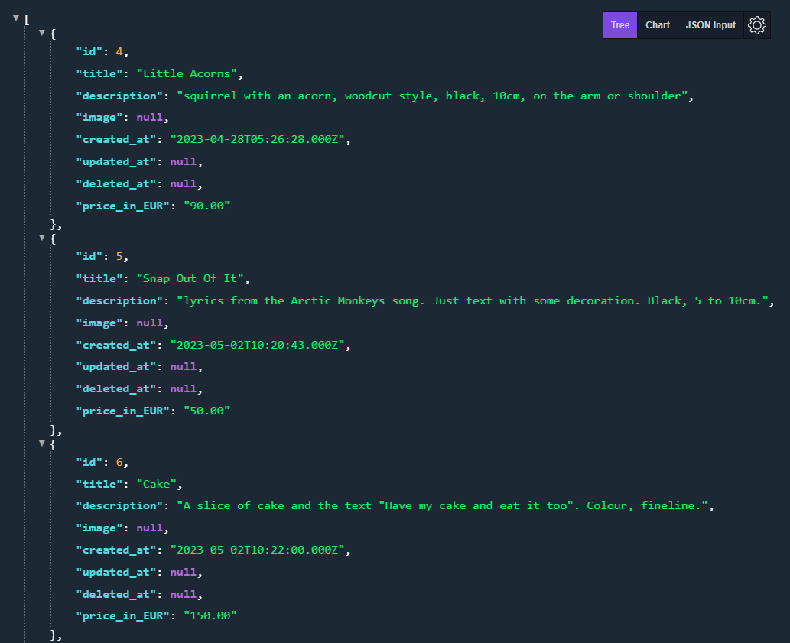
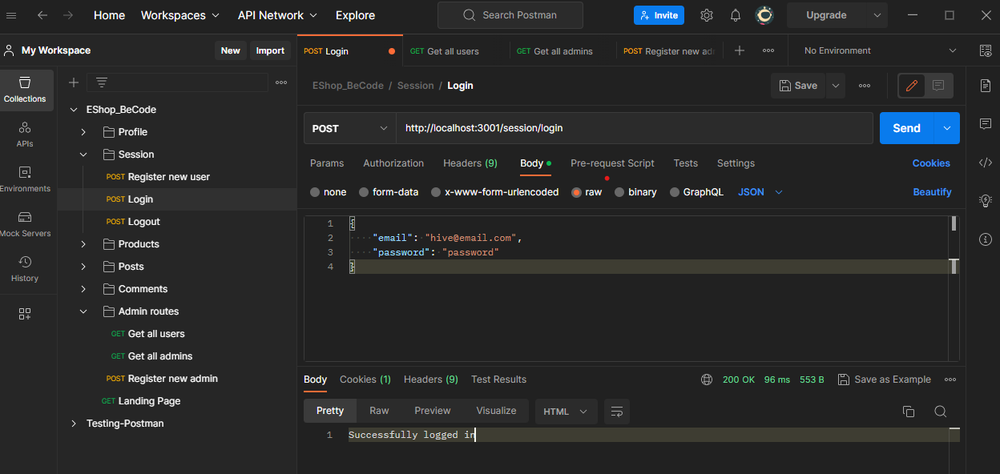
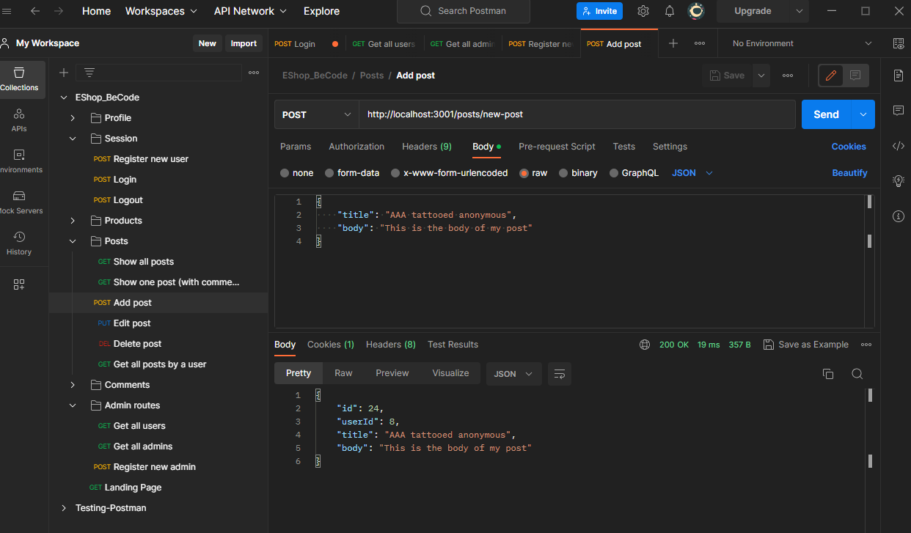

# Tattoo E-Shop in Express.js

## Introduction

Developed by: Beatrice Schembri

Date: May 2023

Link to the deployed version: [here](https://github.com/BiceSchembri/express-API-tattoo)

Dev.to article on using Postman: [here](https://dev.to/biceschembri/how-i-used-postman-to-test-my-express-api-1bk0)

---

This project was initially developed as an exercise for the BeCode Junior Web Developer course, backend track. Its aim was to build:

- a simple e-shop structure with CRUD logic for the products,

- an authentication system (user registration and login, admin privileges) using JWT tokens,

- a post and comments system.

using the **Express** framework for **Node.js**.

Only the backend part was developed, meaning no HTML/CSS files (client side) were added.

For development and testing purposes, I used the [**Postman API platform**](https://www.postman.com/).

[]

The website would allow users to browse throgh tattoo designs. Tattoos (in other words, the products) are stored in a database (each one has a title, description and some other information). New records can be created, and existing ones can updated, deleted.

Users can register and login, access their profile, update and delete it.

[]

They can also publish their own posts, and comment under other users's posts. They can edit or delete their own post, and delete their own comments.

Admins can create other admin profiles, as well as perform CRUD operations on users's profiles. They can also delete other users's posts and comments.

## Requirements

In order to run this project on your computer, you will need:

- Node.js
- a package manager
- a database

### Node.js

Open your terminal or command interface. Type:

`node --version` or `node -v`

Is it installed? If not, follow the steps on [NodeJs](https://nodejs.org/en/) website.
Choose a version (LTS recommended) and follow the default options when installing.

### Package Manager

It should have been automatically installed with NodeJs. In your terminal, check of you have it by typing:

`npm --version` or `npm -v`

### Database

You will need to set up a database containing the records (or products, or tattoos in this case) you want to display on your page.

## Installation

Open your terminal and clone the repository using an SSH key:

`git clone git@github.com:BiceSchembri/express-API-tattoo.git`

Navigate to the newly cloned project folder:

`cd express-API-tattoo`

Install the necessary dependencies in the root of your project:

`npm install`.

---

Now, create a new database called **tattoo_eshop**. It should contain the following tables:

**Users**
| Name | Datatype | Length/Set | Allow NULL | Default |
| :---: |:---:| :---:| :---: | :---:|
| id | INT | 10 | no | AUTO-INCREMENT |
| firstname | VARCHAR | 255 | no | No default |
| lastname | VARCHAR | 255 | no | No default |
| username | VARCHAR | 255 | no | No default |
| email | VARCHAR | 255 | no | No default |
| password | TEXT | | no | No default |
| is_admin | TINYINT | 1 | no | 0 |
| created_at | TIMESTAMP | | yes | NULL |
| updated_at | TIMESTAMP | | yes | NULL |

**Tattoos**
| Name | Datatype | Length/Set | Allow NULL | Default |
| :---: |:---:| :---:| :---: | :---:|
| id | INT | 11 | no | AUTO-INCREMENT |
| title | TEXT | | no | No default |
| description | TEXT | | no | No default |
| image | VARCHAR | 255 | yes | NULL |
| created_at | TIMESTAMP | | yes | current_timestamp() |
| updated_at | TIMESTAMP | | yes | NULL ON UPDATE current_timestamp()|
| deleted_at | TIMESTAMP | 255 | yes | No default |
| price_in_EUR | DECIMAL | 10,2 | yes | NULL |

**Posts**
| Name | Datatype | Length/Set | Allow NULL | Default |
| :---: |:---:| :---:| :---: | :---:|
| id | INT | 10 | no | AUTO-INCREMENT |
| user_id | INT | 10 | no | No default |
| title | VARCHAR | 50 | no | No default |
| body | TEXT | | no | No default |
| created_at | TIMESTAMP | | yes | NULL |
| updated_at | TIMESTAMP | | yes | NULL |

**Comments**
| Name | Datatype | Length/Set | Allow NULL | Default |
| :---: |:---:| :---:| :---: | :---:|
| id | INT | 10 | no | AUTO-INCREMENT |
| post_id | INT | 10 | no | No default |
| user_id | INT | 10 | no | No default |
| body | TEXT | | no | No default |
| created_at | TIMESTAMP | | yes | NULL |
| updated_at | TIMESTAMP | | yes | NULL |

Note that all id's are set as `primary key`.

Collation: `uft8mb4_unicode_ci`.

---

Create a new **.env** file in your root folder. Copy the contents of the **.env.example** in it. Then set the configuration and the database connection (you can change them according to your preferred settings).

```HOST=**localhost**
PORT= 3001
DB_NAME= tattoo_eshop
DB_USER= root
DB_PORT= 3306
DB_HOST= localhost
DB_PASSWORD= (your password here)
JWT_ACCESS_TOKEN= (your access token here)

```

(To learn more about JWT access tokens, see [here](https://jwt.io/) and [here](https://www.ibm.com/docs/da/order-management?topic=SSGTJF/configuration/t_GeneratingJWTToken.htm)).

---

**_IMPORTANT!_**

Add a **.gitignore** file to your project folder if you don't have one already. In it, add:

- the **.env** file you created, to avoid sharing your password if you decide to push the project to a remote repository;
- the **node_modules** (they're very heavy!).

---

From your terminal, go to the server folder and run:

`npm run dev`

to start running the local server.

## Usage

Once the server is running, open http://localhost:3001 in your browser.

It should show you the landing page with a short welcome text.

Navigate to http://localhost:3001/products to see the list of products / tattoos that were added in your database.

Navigate to http://localhost:3001/products/ and add the product **id** at the end to show a specific tattoo (for example, http://localhost:3001/products/10). If a tattoo with that id does not exist in the database, a "Record not found" message will be shown.

Use **Postman** to create, delete, update products in your database.

Create new routes and specify

Body --> raw --> JSON

### Example Endpoints

- GET /products - Get a list of all products
- POST /products - Create a new product
- GET /products/:id - Get details for a specific product
- PUT /products/:id - Update a specific product
- DELETE /products/:id - Delete a specific product

### Example requests

To create a new product:
method: POST
route: /products

```
{
"title": "My tattoo design",
"description": "A beautiful and unique tattoo design",
"image": null
"price_in_EUR": "100",
}
```

[]

## Main Features

- Database connection
- API, data is sent back as JSON
- CRUD logic
- JWT password authentication
- Managing privileges
- Dynamic routes, Express routings
- Middleware to validate POST requests
- Middleware for non-existing routes (404 error)
- Appropriate code status responses

---

Beatrice Schembri - 2023 - BeCode Ghent
